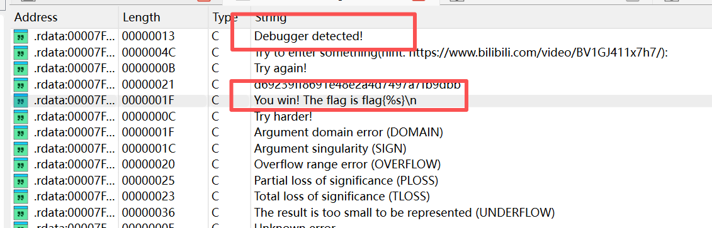
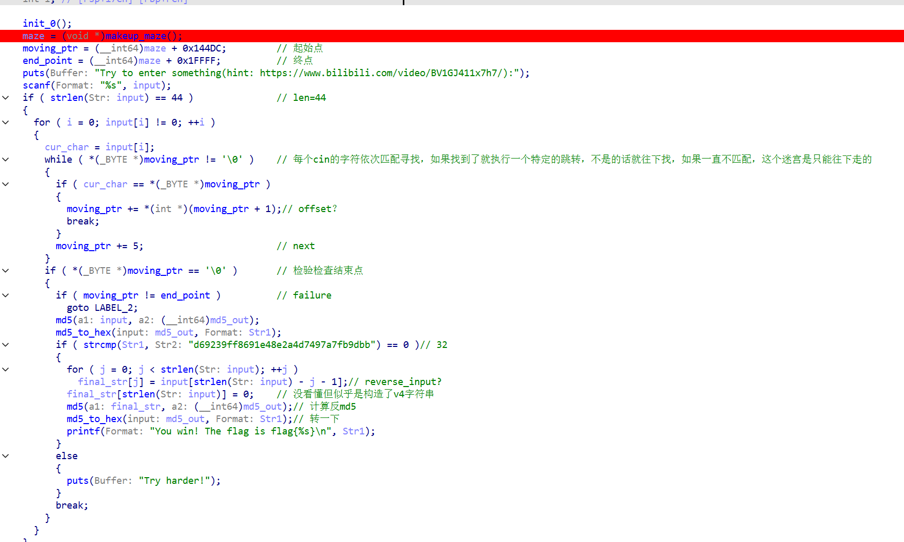
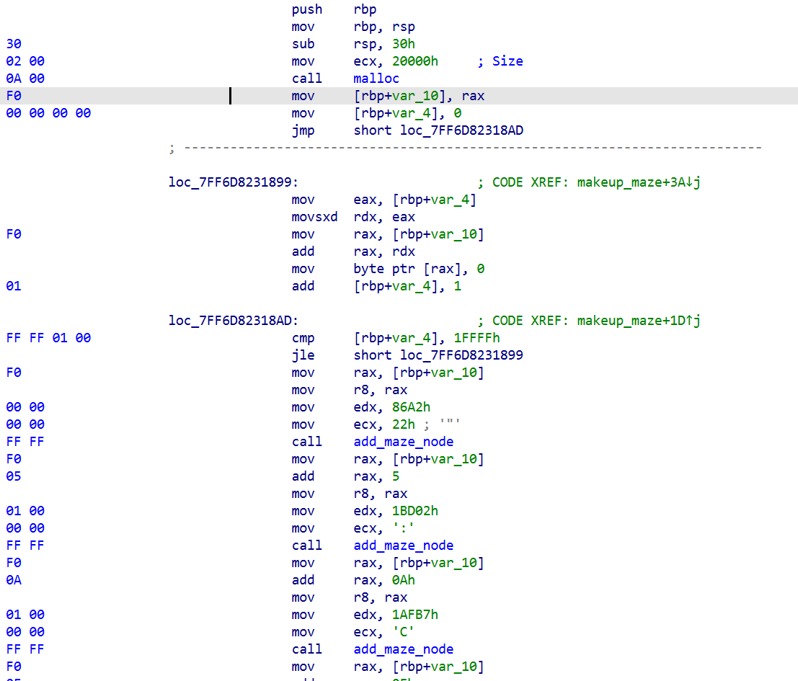
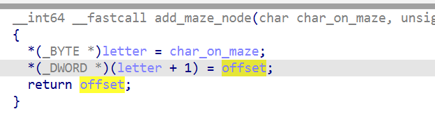
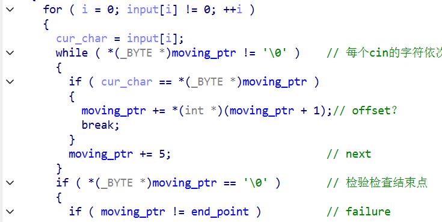
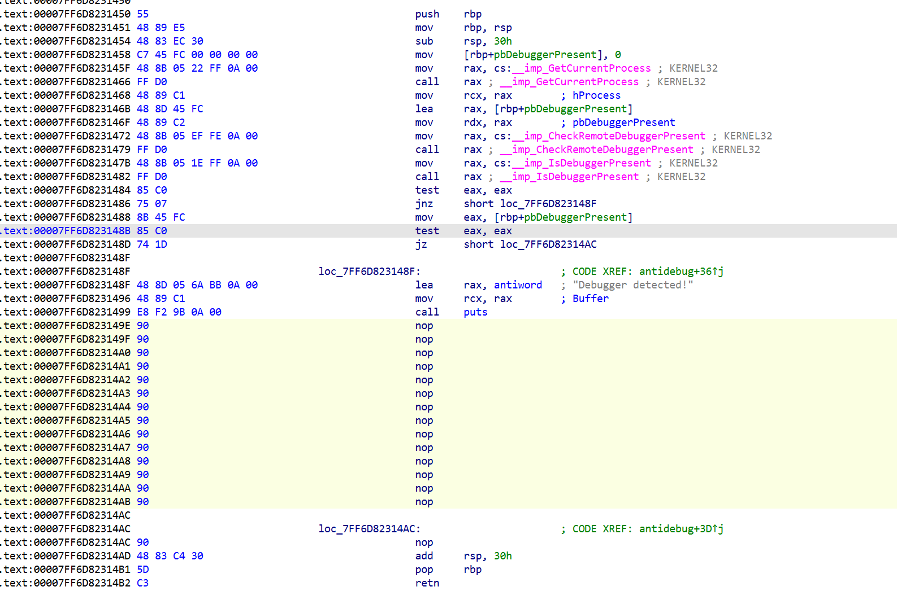
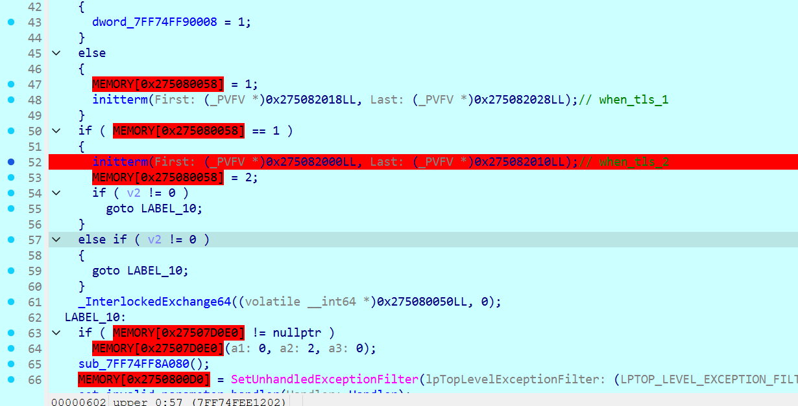
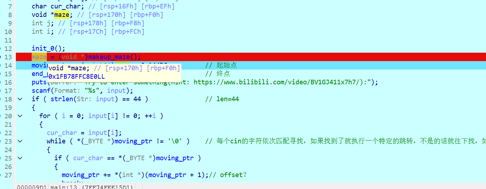

# Maze 题解

shift+f12追踪strings找一下

还顺带发现了反调试相关逻辑，不过不着急，先看主加密函数

稍微分析大概是这样，其中这个`makingup_maze()`过大无法分析，不过可以看看汇编得知一些信息

可以看到目标大小是`20000h`，再分析一下这个`add_maze_node`

联系主函数的那一句：

可以知道这个迷宫是怎么执行的：不过我认为这个点特别难想到，感觉出题人出的题很有趣，也很厉害，我做这题花了大约一天半，主要就是推断迷宫的执行了

由于迷宫过大，我们只能dump迷宫出来，但是又有反调试，所以现在要过反调

一开始暴力nop掉这个点试图强过，但是发现我nop掉的东西居然被重新写入了，也就是说存在更早的点修改了这里的代码，一步步动调找了找

发现到达这里会再次写入，于是设下断点脚本再次nop掉Exitprocess点，发现反调试不再出现

然后简单dump出来迷宫，然后ai写出bfs搜索脚本即可

