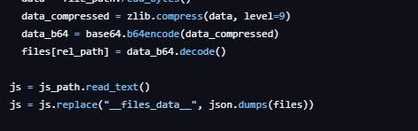
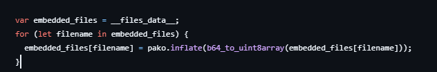
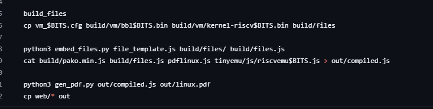
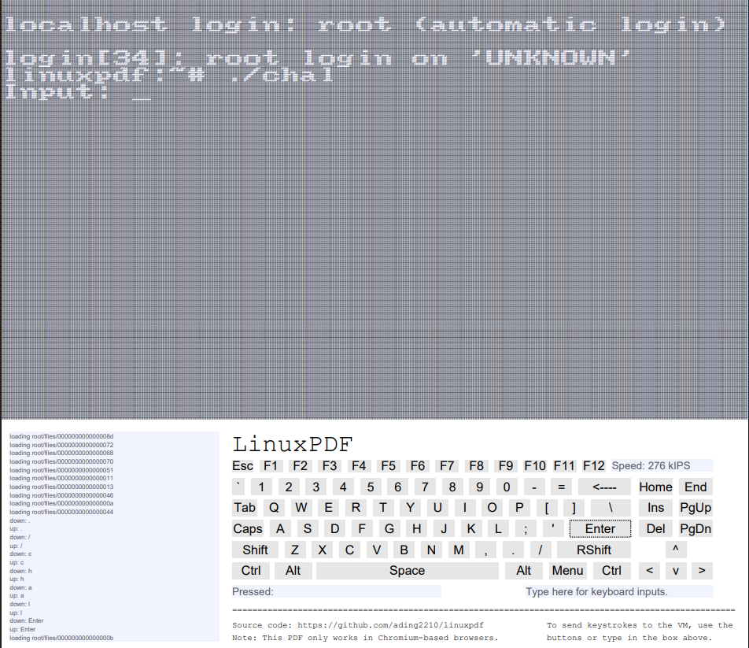

# 关于一道有趣的题目设计

## 参考

<https://github.com/ading2210/linuxpdf>

以及25年9月TPCTF的linuxpdf题目

## 先介绍原理

- PDF中的JavaScript：PDF格式支持JavaScript。虽然浏览器中的PDF引擎只支持部分API，但这足以运行代码
- C到JavaScript的编译：Linux是用C语言写的。项目利用一个叫 Emscripten 的旧版本工具，将C代码编译成 asm.js。asm.js是JavaScript的一个子集，能在PDF中高效运行
- 运行RISC-V模拟器：核心是 TinyEMU，一个轻量级的RISC-V系统模拟器。开发者把它编译成asm.js后嵌入PDF，模拟器启动后便会加载并运行一个极简的Linux内核

```bash
git clone https://github.com/ading2210/linuxpdf
cd linuxpdf
pip install -r requirements.txt
```

```bash
sudo apt update

sudo apt install -y gcc-riscv64-linux-gnu qemu-user qemu-user-static binfmt-support

```

随即编写好所需的`challenge.c`

```bash
mkdir -p challenge
cd challenge
riscv64-linux-gnu-gcc -static -O2 -o chal64 chal.c
file chal64          # 确认是 RISC-V 64-bit
qemu-riscv64 ./chal64  # 本地测试
cd ..

```
由于我的wsl2是x86_64，所以我更改了build.sh里面的`BITS`

但是
```bash

./build.sh
```

后发生问题

但是还有地方也是架构不匹配发生问题

Alpine 根文件系统中的所有程序都是针对 RISC-V 编译的

```bash
# 复制 QEMU 静态模拟器
sudo cp /usr/bin/qemu-riscv64-static build/alpine/usr/bin/

# 设置 DNS
echo -e "nameserver 1.1.1.1\nnameserver 8.8.8.8" | sudo tee build/alpine/etc/resolv.conf

# 设置软件源
sudo tee build/alpine/etc/apk/repositories > /dev/null << EOF
https://dl-cdn.alpinelinux.org/alpine/v3.24/main
https://dl-cdn.alpinelinux.org/alpine/v3.24/community
EOF

# 安装必要软件
sudo chroot build/alpine /usr/bin/qemu-riscv64-static /sbin/apk update
sudo chroot build/alpine /usr/bin/qemu-riscv64-static /sbin/apk add --no-cache agetty nano htop

# 配置自动登录和启动脚本
echo "tty1::respawn:/sbin/agetty --autologin root tty0 linux" | sudo tee build/alpine/etc/inittab

sudo tee build/alpine/root/.profile > /dev/null << 'EOF'
#!/bin/sh
mount -t proc none /proc
mount -t sysfs none /sys
hostname -F /etc/hostname
echo 'VM boot complete' > /dev/hvc0
EOF
sudo chmod +x build/alpine/root/.profile

echo "linuxpdf" | sudo tee build/alpine/etc/hostname
echo -n "" | sudo tee build/alpine/etc/motd
```

以上将 QEMU 静态模拟器放入 chroot 环境，确保 chroot 内也可以执行 RISC-V 程序，并配置 DNS，设置 Alpine 软件源

```bash
sudo cp challenge/chal64 build/alpine/root/chal
sudo chmod +x build/alpine/root/chal
```

将文件放入后重新打包

```bash
rm -rf build/files
./build.sh
```

## 题解



阅读源代码知道embed_files.py将files经过zlib+base64后生成一个字典并替换了__files_data__



在file_template.js中又可以看见__files_data__被传入这里



在这里又可以看见将四个 JS 模块按顺序拼接成一个完整的文件，再将拼接好的 JavaScript 代码注入到一个 PDF 文件中，生成最终的 linux.pdf

因为这个字典是js啊，我们以文本模式打开的时候可以读到，直接定位就行

```python
import base64
import zlib
import os
import re

def base64_decode_and_inflate(encoded_data):
    try:
        compressed_data = base64.b64decode(encoded_data)

        # 尝试 zlib
        try:
            decompressed_data = zlib.decompress(compressed_data)
            return decompressed_data
        except zlib.error:
            pass

        # 尝试 gzip
        try:
            decompressed_data = zlib.decompress(compressed_data, 16 + zlib.MAX_WBITS)
            return decompressed_data
        except zlib.error:
            pass

        # 尝试 raw deflate
        try:
            decompressed_data = zlib.decompress(compressed_data, -zlib.MAX_WBITS)
            return decompressed_data
        except zlib.error as e:
            print(f"解压缩失败: {e}")
            return None

    except Exception as e:
        print(f"解码失败: {e}")
        return None


def main():
    pdf_path = r"path"  # 改成你的 PDF 路径
    output_dir = "extracted"                        # 提取到这个文件夹

    with open(pdf_path, "r", encoding="utf-8", errors="ignore") as f:
        content = f.read()

    # 定位数据段（根据你原来的逻辑）
    start_index = content.find('"vm_64.cfg"')
    if start_index == -1:
        print("找不到 vm_64.cfg，请检查 PDF 或搜索关键字")
        return

    end_marker = "for \\(let filename i"
    end_index = content.find(end_marker, start_index)
    if end_index == -1:
        print("找不到结束标记")
        return

    data_section = content[start_index:end_index - 4]

    # 按 ", " 分割每条记录
    items = data_section.split(", ")

    success = 0
    failed = 0

    for item in items:
        if ": " not in item:
            continue

        try:
            path_part, data_part = item.split(": ", 1)
            file_path = path_part.replace('"', "").strip()
            b64_data = data_part.replace('"', "").strip()

            if not file_path or not b64_data:
                continue

            decoded = base64_decode_and_inflate(b64_data)
            if decoded is None:
                print(f"[失败] {file_path}")
                failed += 1
                continue

            # 完整输出路径
            full_path = os.path.join(output_dir, file_path)

            # 自动创建目录
            dir_name = os.path.dirname(full_path)
            if dir_name:
                os.makedirs(dir_name, exist_ok=True)

            with open(full_path, "wb") as out:
                out.write(decoded)

            print(f"[成功] {full_path}  ({len(decoded)} bytes)")
            success += 1

        except Exception as e:
            print(f"[异常] {item[:50]}... -> {e}")
            failed += 1

    print("\n========== 完成 ==========")
    print(f"成功: {success}")
    print(f"失败: {failed}")
    print(f"文件保存在: {os.path.abspath(output_dir)}")


if __name__ == "__main__":
    main()
```

然后发现dump出来一堆东西怎么定位呢



细看左下角可以看到load了什么，直接对着找出来就行

然后就是解里面的题了